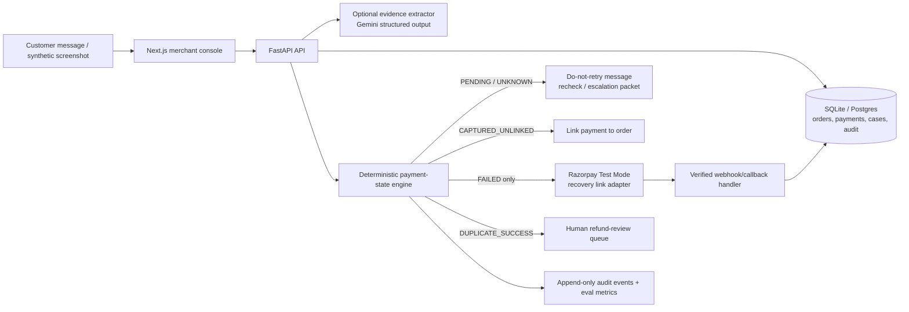

# Architecture & Technology Decisions — PayState Bridge

**Research date:** 30/08/2026. Re-check current package versions, provider pricing, Test Mode limits, and terms immediately before installation or deployment.

## 1. One-sentence architecture

**A Next.js merchant-support console calls a FastAPI modular monolith that validates synthetic incident evidence, applies deterministic payment-state and recovery rules, uses Gemini only to structure untrusted customer text/screenshots, and invokes Razorpay Test Mode only after a verified-failure recovery permit.**

## 2. Architecture diagram



## 3. Evidence-backed decisions

| Component | Decision | Why it fits | Current source / fallback |
|---|---|---|---|
| IDE/workflow | VS Code + Google Antigravity + GSD | Matches Bhavesh’s existing workflow and supports spec-driven slices/atomic commits. | Antigravity VS Code requires VS Code 1.90+ and Google-account entitlement; [official docs](https://antigravity.google/docs/ide/extensions/vscode/). Fallback: normal VS Code terminal/Git workflow. |
| Web UI | Next.js App Router + TypeScript | Good merchant console UI, easy deployment and Playwright testing. | [Next.js deployment](https://nextjs.org/docs/app/getting-started/deploying), [testing](https://nextjs.org/docs/app/guides/testing). Fallback: simple React/Vite if Next server features are unnecessary. |
| API | FastAPI + Python 3.12+ | Python is ideal for Pydantic validation, deterministic policy code, test fixtures, Gemini integration. | [FastAPI testing](https://fastapi.tiangolo.com/tutorial/testing/). Fallback: server-only Next route handlers only if Python is removed. |
| Data | SQLite first; Postgres only for deployed staging | v0 has one merchant and synthetic events; SQLite removes setup friction. Use migrations so moving later is possible. | SQLAlchemy async documentation checked 20/08/2026. Fallback: stay SQLite for a local judging demo. |
| Validation | Pydantic v2 strict models | Separates untrusted screenshot/customer text from trusted merchant event facts. | [Pydantic config](https://docs.pydantic.dev/latest/concepts/config/). |
| AI extraction | Gemini structured output, optional image input | Good for turning a synthetic screenshot/text into typed fields (amount, apparent status, UTR-like ref). It must never decide recovery state. | [Structured output](https://ai.google.dev/gemini-api/docs/structured-output), [image understanding](https://ai.google.dev/gemini-api/docs/image-understanding). Fallback: fixture extractor and manual typed entry. |
| Payment action | Razorpay Test Mode Payment Links | Direct Buildathon connection; API supports create/fetch/cancel and callbacks/webhooks. | [Payment Links APIs](https://razorpay.com/docs/payments/payment-links/apis/), [Test Mode creation](https://razorpay.com/docs/payments/payment-links/create/). Fallback: `FakePaymentProvider`; label it clearly. |
| Event verification | Razorpay raw-body HMAC callback/webhook verifier + idempotent receipt table | Browser redirect and customer screenshot are not authoritative. | [Razorpay Payment Link webhooks](https://razorpay.com/docs/webhooks/payment-links/). |
| Tests | Pytest + Playwright | Policy logic needs fast unit tests; merchant console needs browser flow tests. | [Next.js test guidance](https://nextjs.org/docs/app/guides/testing). |
| CI | GitHub Actions | Run lint, types, tests, synthetic recovery eval, and build on every pull request. | [GitHub Node CI](https://docs.github.com/actions/guides/building-and-testing-nodejs) and [Python CI](https://docs.github.com/en/actions/tutorials/build-and-test-code/python). |

## 4. Deliberate exclusions

| Not using | Why |
|---|---|
| Direct PhonePe / GPay / bank / NPCI APIs | No public student access and no authority to read live consumer payment state. |
| Fine-tuning | Structured extraction is not a training problem. Fixtures + Pydantic + deterministic policy are faster and more defensible. |
| Vector database / RAG | Payment/order lookup is exact and relational: order ID, payment ID, amount, event time. SQLite queries are safer. |
| Multi-agent architecture | One deterministic recovery state machine is easier to audit and safer than agent delegation. |
| Blockchain | Append-only audit records are sufficient for a portfolio prototype. |
| Full refund execution | Merchant approval and real financial permissions are outside v0. Create a review case only. |
| Full complaint filing | NPCI/RBI/bank flows are external and regulated. Generate evidence packet only. |

## 5. Trust boundaries

| Boundary | What it may do | What it must never do |
|---|---|---|
| Browser | Collect synthetic customer message/screenshot; display case and decision | Send Razorpay secret, determine payment truth, mark order paid, create payment action directly. |
| Gemini extractor | Propose typed fields from untrusted text/image | Decide payment state, create payment links, override merchant event evidence. |
| Merchant event service | Read synthetic/Razorpay Test Mode payment events | Interpret a customer screenshot as final settlement proof. |
| Policy engine | Deterministically map verified evidence to state and next action | Guess missing state or promise bank recovery. |
| Razorpay adapter | Create one Test Mode recovery link from an unexpired recovery permit | Create a link while original state is pending/unknown. |
| Webhook handler | Verify raw HMAC, deduplicate events, apply legal state transition | Trust browser callback or malformed/duplicate event. |

## 6. Repository shape

```text
paystate-bridge/
  apps/
    web/                        # Next.js merchant-support console
      app/
      components/
      tests/e2e/
    api/                        # FastAPI modular monolith
      app/
        api/                    # HTTP routes
        domain/                 # state machine, recovery policy, entities
        schemas/                # Pydantic request/event contracts
        services/               # case, order, evidence, audit services
        integrations/           # Gemini + Razorpay providers
        db/                     # SQLAlchemy models, migrations, seed
        evals/                  # fixture runner and scorers
      tests/
  data/
    incidents/                  # synthetic scenarios only
    screenshots/                # synthetic mock screenshots only
  docs/
  .github/workflows/ci.yml
  .env.example
```

## 7. Security and privacy baseline

- Synthetic data only. Use fake UTR-like references; never upload a real bank statement or real PhonePe/GPay screenshot to a model.
- `APP_ENV=demo` must refuse non-test Razorpay key configuration.
- Secrets live in local environment variables/hosting secret manager only. Never commit them, show them in video, or put them in CI caches.
- Store money as integer paise, not floating-point rupees.
- Capture source type for every fact: `customer_report`, `synthetic_screenshot`, `merchant_order`, `gateway_event`, `policy`. Do not confuse these trust levels.
- Rate-limit case creation and screenshot extraction if publicly deployed.
- Redact amount/reference before structured logs when not strictly needed; retain only synthetic fixture values in demo logs.

## 8. Deployment

Start locally. Deploy only after the core policy/evaluation suite works. A public staging URL is needed only if testing Razorpay webhooks. Razorpay Test Mode links are limited to 30 links per business according to current documentation, so use the fake provider in automated tests and reserve Test Mode for manual proof.

Do not activate Live Mode, request real customer data, or publish an integration claiming bank/NPCI connectivity without explicit human approval.
