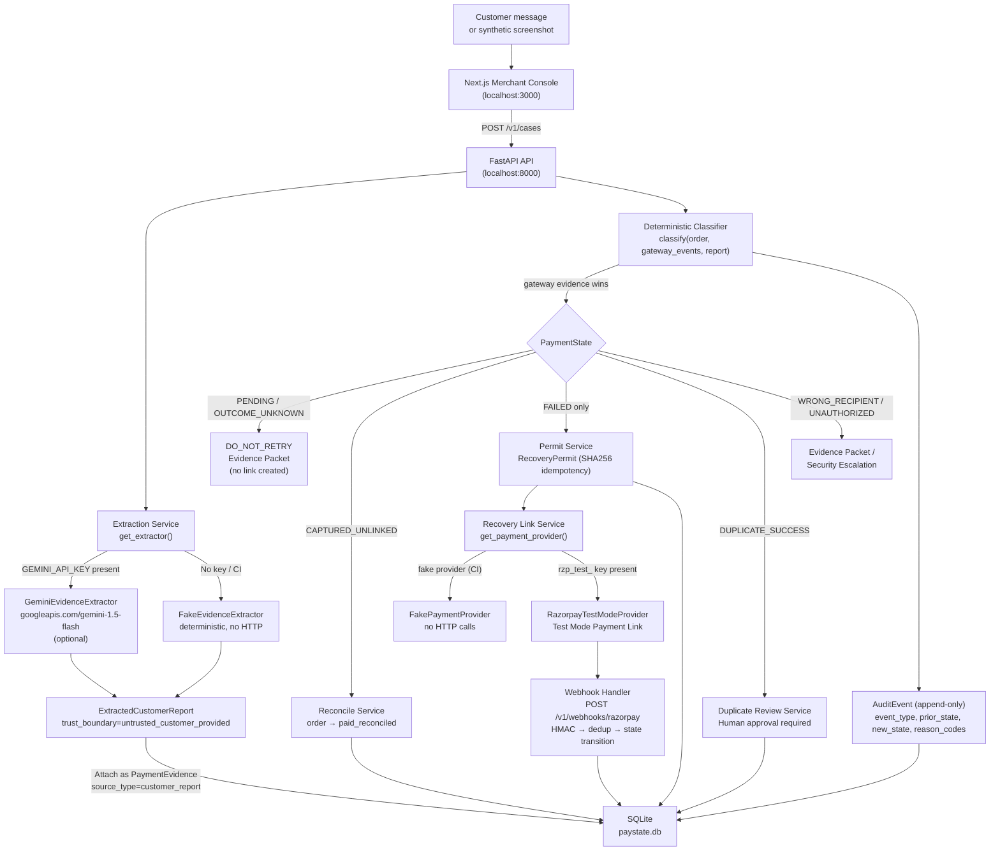

<!-- generated-by: gsd-doc-writer -->
# PayState Bridge — High-Level Design

> **Prototype maturity:** Razorpay AI Buildathon Track 03. Synthetic incidents and Razorpay Test Mode only. No real bank or NPCI access.

---

## 1. System Overview

PayState Bridge is a merchant-side payment ambiguity resolver. When a customer's UPI or card payment reaches an ambiguous state — debited but unconfirmed, captured but unlinked to an order, or duplicated — the merchant console calls a FastAPI policy engine that deterministically classifies the true payment state from authoritative gateway evidence and then prescribes the safest next action before the merchant ever asks the customer to pay again. Gemini (optional) structures unverified customer text or synthetic screenshots into typed fields, but the model output is never used to decide payment state or trigger recovery actions. Razorpay Test Mode (or a deterministic FakePaymentProvider for CI) handles recovery link creation exclusively for cases whose payment is conclusively FAILED. All evidence, decisions, and state transitions are recorded in an append-only audit trail in SQLite.

---

## 2. Architecture Diagram



---

## 3. Component Responsibilities

| Component | Location | Responsibilities | What It Must NOT Do |
|---|---|---|---|
| **UI — Next.js Merchant Console** | `apps/web/` | Display case state, evidence timeline, recovery actions. Accept customer message or screenshot fixture. Submit evidence to API. | Send Razorpay secrets. Determine payment truth. Create payment actions directly. |
| **API — FastAPI Modular Monolith** | `apps/api/app/` | Route HTTP requests. Enforce startup safety config. Orchestrate services. Return typed JSON responses. | Trust browser-submitted payment state claims. Skip HMAC verification. |
| **DB — SQLite (aiosqlite + SQLAlchemy async)** | `apps/api/paystate.db` | Persist MerchantOrder, PaymentCase, PaymentEvidence, RecoveryAction, AuditEvent. Enforce unique constraints (idempotency keys). | Store real UTRs, live bank data, or production credentials. |
| **Policy Engine — Deterministic Classifier** | `app/domain/classifier.py` | Map gateway events + merchant order to PaymentState. Apply authoritative evidence precedence. Output RecoveryDecision with reason codes. | Use LLM output to decide state. Guess missing state. Issue permits for PENDING or OUTCOME_UNKNOWN. |
| **AI Intake — Evidence Extractors** | `app/integrations/fake_extractor.py`, `gemini_extractor.py` | Parse customer text/synthetic screenshots into typed ExtractedCustomerReport fields. Block injection patterns before API call. | Decide payment state. Call Razorpay APIs. Override gateway evidence. Receive or store real customer data. |
| **Payment Provider — Fake / Razorpay Test Mode** | `app/integrations/fake_provider.py`, `razorpay_provider.py` | Create one recovery payment link per valid RecoveryPermit. Verify HMAC signatures on webhooks. Deduplicate events. | Create links while payment is PENDING or OUTCOME_UNKNOWN. Accept live Razorpay keys (blocked at config). |

---

## 4. Data Flow Narrative

A complete case lifecycle follows these steps:

1. **Customer report arrives.** The merchant console collects a customer's message ("PhonePe shows ₹999 debited") or a synthetic screenshot fixture name and posts it to `POST /v1/cases/{id}/evidence`.

2. **Extraction service structures the untrusted input.** `get_extractor()` selects `GeminiEvidenceExtractor` if `GEMINI_API_KEY` is set, otherwise `FakeEvidenceExtractor`. Both check for injection patterns first and block the request if detected. The extractor outputs an `ExtractedCustomerReport` with `trust_boundary=untrusted_customer_provided`. This is stored as a `PaymentEvidence` row with `source_type=customer_report` or `source_type=synthetic_screenshot`.

3. **Gateway events are attached.** Merchant or gateway payment events (status: `pending`, `captured`, `failed`) are attached as `PaymentEvidence` rows with `source_type=gateway_event`. These are authoritative.

4. **Classifier runs.** `POST /v1/cases/{id}/classify` invokes `classify(order, gateway_events, customer_report)`. Gateway evidence takes precedence. Rules apply in order: WRONG_RECIPIENT hint → UNAUTHORIZED hint → no gateway events → two captured events → single captured → all failed → all pending → conflicting → OUTCOME_UNKNOWN. The classifier returns a `RecoveryDecision` with `PaymentState`, `RecoveryAction`, `reason_codes`, and a safe `customer_message`.

5. **Recovery action executes (state-gated).** Only FAILED cases may proceed past this point:
   - **CAPTURED_UNLINKED** → `reconcile_order()` checks exact amount, reference, and 30-minute window; transitions order to `paid_reconciled`.
   - **FAILED** → `issue_recovery_permit()` issues a `RecoveryPermit` (SHA256 idempotency key from case_id + order_id + amount_paise); `create_recovery_link()` calls the payment provider; case transitions to `RECOVERY_LINK_CREATED`.
   - **DUPLICATE_SUCCESS** → `open_duplicate_review()` records both payment IDs and requires human approval before any refund.
   - **OUTCOME_UNKNOWN / WRONG_RECIPIENT** → `build_evidence_packet()` assembles evidence references and official escalation route. No link created.

6. **Webhook confirms payment.** `POST /v1/webhooks/razorpay` verifies the HMAC on raw body first, deduplicates by `event_id`, then finds the `RecoveryAction` by `provider_link_id`. On `payment_link.paid`, the case transitions to `RECOVERY_PAID_TEST`.

7. **Audit trail appended.** Every state transition writes an `AuditEvent` row with `event_type`, `prior_state`, `new_state`, `reason_codes`, and `evidence_ids`. The audit log is append-only; no row is modified after creation.

---

## 5. Trust Boundary Table

| Boundary | What It May Do | What It Must Never Do |
|---|---|---|
| Browser / Next.js UI | Collect synthetic customer message or screenshot fixture. Display case, evidence timeline, and decision. | Send Razorpay secret key. Determine payment truth. Mark order paid directly. Create recovery actions without API mediation. |
| Gemini Extractor | Propose typed fields (amount, status, UTR-like reference) from untrusted text. Operate with temperature=0 and max 256 output tokens. | Decide payment state. Create payment links. Override merchant/gateway evidence. Receive or store real bank screenshots. |
| FakeEvidenceExtractor | Deterministically parse synthetic fixture patterns. Block injection strings. | Contact any external API. Produce a payment state or recovery action. |
| Merchant/Gateway Evidence | Provide authoritative status (captured, failed, pending) for the classifier. | Be overridden by customer report or model output. |
| Policy Engine (Classifier) | Deterministically map verified evidence to PaymentState and RecoveryAction. Apply gateway-wins precedence. | Guess missing state. Issue CREATE_RECOVERY_PERMIT for PENDING or OUTCOME_UNKNOWN. Trust LLM-provided payment state. |
| Permit Service | Issue one RecoveryPermit for conclusively FAILED cases. Enforce idempotency. | Issue a permit for any state other than FAILED. Issue a permit when order is already paid. |
| Payment Provider (Fake / Razorpay Test) | Create one Test Mode recovery link from a valid unexpired RecoveryPermit. Verify HMAC signatures. | Create a link while original state is PENDING or OUTCOME_UNKNOWN. Accept a live Razorpay key (`rzp_live_` prefix rejected at startup). |
| Webhook Handler | Verify raw-body HMAC. Deduplicate by event_id. Apply legal state transition on `payment_link.paid`. | Trust a browser-redirect callback. Parse event body before HMAC verification. Apply an illegal state transition. |

---

## 6. Key Design Decisions

| Decision | Choice | Rationale |
|---|---|---|
| **Database** | SQLite (aiosqlite + SQLAlchemy async) | v0 has one synthetic merchant and no concurrent write load. SQLite removes all setup friction for local demo and CI. Migrations are written with SQLAlchemy so switching to Postgres later is mechanical. |
| **Policy engine** | Deterministic Python classifier, not LLM | Payment state classification is a finite state problem with exact evidence precedence rules. A deterministic classifier is auditable, has zero hallucination risk, and is faster than a round-trip to a model. The LLM is reserved for the narrower problem of parsing unstructured customer text. |
| **FakePaymentProvider in CI** | Mandatory for all tests | Razorpay Test Mode is rate-limited to 30 payment links per business. Using real API calls in CI would exhaust the quota and require credentials in every developer environment. FakePaymentProvider is deterministic, produces stable link IDs from the idempotency key, and makes no HTTP calls. |
| **Gemini for extraction only** | Structured output, optional | Gemini is the right tool for converting a freeform customer sentence into typed fields. It is the wrong tool for deciding payment state — that decision must be auditable and deterministic. Gemini output is always tagged `untrusted_customer_provided` and never used as authoritative evidence. |
| **Idempotency keys** | SHA256(case_id + order_id + amount_paise) truncated to 32 hex chars | Repeated requests from UI double-submits or retries must return the same permit and link without creating duplicates. The key is derived from stable identifiers so it survives app restarts. |
| **Config safety guard** | `APP_ENV` must be `demo`; `RAZORPAY_KEY_ID` must start `rzp_test_` | Checked at FastAPI startup via `lifespan`. If misconfigured, the process calls `sys.exit(1)` before accepting any request. This prevents accidental live-mode charges during a demo or CI run. |
| **Append-only audit log** | `AuditEvent` rows are inserted, never updated | Every state transition, evidence attachment, and recovery action is recorded immutably. This provides a complete, reviewable case timeline for the hackathon demo and for the evidence packet. |

---

## 7. Deployment Topology

### Local Development (primary target)

```
┌─────────────────────────────────────────────────────────────┐
│  Developer Workstation                                       │
│                                                              │
│  ┌──────────────────┐       ┌────────────────────────────┐  │
│  │  Next.js Dev      │       │  FastAPI (uvicorn)          │  │
│  │  localhost:3000   │──────▶│  localhost:8000             │  │
│  │  npm run dev      │       │  APP_ENV=demo               │  │
│  └──────────────────┘       │  PAYMENT_PROVIDER=fake      │  │
│                              │  DATABASE_URL=sqlite:///... │  │
│                              └──────────────┬─────────────┘  │
│                                             │                │
│                                    ┌────────▼────────┐      │
│                                    │  paystate.db     │      │
│                                    │  (SQLite)        │      │
│                                    └─────────────────┘      │
└─────────────────────────────────────────────────────────────┘
```

- No external services required. FakePaymentProvider and FakeEvidenceExtractor handle all CI tests.
- Add `GEMINI_API_KEY` to `.env` to enable live Gemini text extraction.
- Add `RAZORPAY_KEY_ID` (`rzp_test_` prefix) and `RAZORPAY_KEY_SECRET` to enable real Test Mode payment links.

### Optional Staging (webhook testing only)

A public HTTPS URL is required only if testing real Razorpay webhooks. A tunneling solution (e.g., `ngrok http 8000`) exposes the local FastAPI instance. The webhook endpoint is `POST /v1/webhooks/razorpay`. Razorpay Test Mode payment links are limited to 30 per business — use `PAYMENT_PROVIDER=fake` in all automated tests and reserve Test Mode for manual proof.

Do not activate Live Mode, request real customer data, or publish a claim of bank/NPCI connectivity without explicit approval.
