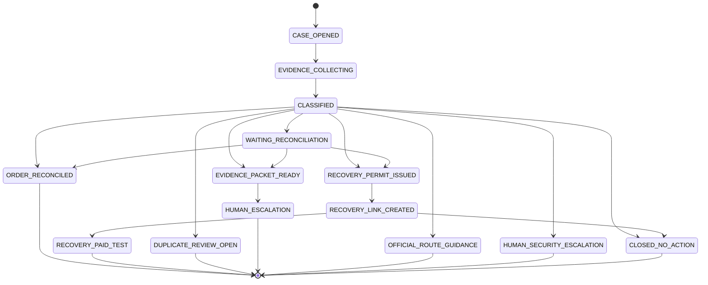

<!-- generated-by: gsd-doc-writer -->
# PayState Bridge — Low-Level Design

> All file paths are relative to `apps/api/`. All policy logic is deterministic Python — no LLM involved in state or action decisions.

---

## Module 1: Recovery State Engine

### 1.1 PaymentCase State Machine

The lifecycle state (`PaymentCase.state`) and payment state (`PaymentCase.payment_state`) are distinct fields. The lifecycle state tracks where the case is in the resolution workflow. The payment state is the authoritative classification of the original payment.



Terminal states (no further transitions): `ORDER_RECONCILED`, `RECOVERY_PAID_TEST`, `DUPLICATE_REVIEW_OPEN`, `HUMAN_ESCALATION`, `OFFICIAL_ROUTE_GUIDANCE`, `HUMAN_SECURITY_ESCALATION`, `CLOSED_NO_ACTION`.

### 1.2 Classifier Algorithm

Source: `app/domain/classifier.py`. Policy version: `v0.1.0`.

```
classify(order, gateway_events, customer_report=None, scenario_hint=""):

  statuses = [e.status for e in gateway_events]

  RULE 1: Scenario hint (explicit override for test/edge cases)
    if scenario_hint == "WRONG_RECIPIENT"
      OR (customer_report.message contains "wrong" AND no captured/failed events)
        → state = WRONG_RECIPIENT, action = OFFICIAL_ROUTE_GUIDANCE

    elif scenario_hint == "UNAUTHORIZED"
        → state = UNAUTHORIZED, action = SECURITY_ESCALATION

  RULE 2: No gateway evidence
    if not gateway_events
        → state = OUTCOME_UNKNOWN, action = DO_NOT_RETRY
           (note: BUILD_EVIDENCE_PACKET for non-empty OUTCOME_UNKNOWN cases)

  RULE 3: Two or more captured events → duplicate payment
    if count(statuses == "captured") >= 2
        → state = DUPLICATE_SUCCESS, action = OPEN_DUPLICATE_REVIEW

  RULE 4: Single captured event
    if len(statuses) == 1 and statuses[0] == "captured"
        if gateway_event.amount_paise != order.amount_paise
            → state = OUTCOME_UNKNOWN, action = BUILD_EVIDENCE_PACKET
        else
            → state = CAPTURED_UNLINKED, action = RECONCILE_ORDER

  RULE 5: All events failed
    if all(s == "failed" for s in statuses) and statuses
        if customer_report.reported_status == "success"
            reason_codes += ["CUSTOMER_CLAIM_OVERRIDDEN_BY_GATEWAY"]
        → state = FAILED, action = CREATE_RECOVERY_PERMIT

  RULE 6: All events pending
    if all(s == "pending" for s in statuses) and statuses
        → state = PENDING, action = DO_NOT_RETRY

  RULE 7: Conflicting statuses (e.g., one captured + one failed)
    if len(set(statuses)) > 1
        → state = OUTCOME_UNKNOWN, action = BUILD_EVIDENCE_PACKET

  RULE 8: Catch-all
    → state = OUTCOME_UNKNOWN, action = BUILD_EVIDENCE_PACKET

  INVARIANT: PENDING and OUTCOME_UNKNOWN → action is NEVER CREATE_RECOVERY_PERMIT
```

### 1.3 AuditEvent Append-Only Pattern

Source: `app/db/models.py` — `AuditEvent` table.

Every service that changes case state inserts a new `AuditEvent` row. No existing row is ever updated. This ensures the full history of a case is reconstructible from the audit table alone.

Fields written on each transition:

| Field | Description |
|---|---|
| `case_id` | Foreign key to `PaymentCase.id` |
| `event_type` | Semantic label, e.g., `ORDER_RECONCILED`, `RECOVERY_PERMIT_ISSUED`, `DUPLICATE_REVIEW_OPENED` |
| `actor` | `"system"`, `"operator"`, `"webhook"` |
| `prior_state` | `PaymentCase.state` before transition |
| `new_state` | `PaymentCase.state` after transition |
| `action` | `RecoveryAction` value (e.g., `"RECONCILE_ORDER"`) |
| `reason_codes` | JSON array of strings explaining why this transition occurred |
| `evidence_ids` | JSON array of evidence row IDs or payment references used |
| `customer_message` | Safe customer-facing message for this state |
| `occurred_at` | UTC timestamp set at insert |

Events are ordered by `occurred_at` in the `PaymentCase.audit_events` relationship.

### 1.4 Legal Transition Table

Source: `app/domain/state_machine.py` — `LEGAL_TRANSITIONS`.

| From State | Allowed Next States |
|---|---|
| `CASE_OPENED` | `EVIDENCE_COLLECTING` |
| `EVIDENCE_COLLECTING` | `CLASSIFIED` |
| `CLASSIFIED` | `WAITING_RECONCILIATION`, `ORDER_RECONCILED`, `RECOVERY_PERMIT_ISSUED`, `DUPLICATE_REVIEW_OPEN`, `EVIDENCE_PACKET_READY`, `OFFICIAL_ROUTE_GUIDANCE`, `HUMAN_SECURITY_ESCALATION`, `CLOSED_NO_ACTION` |
| `WAITING_RECONCILIATION` | `ORDER_RECONCILED`, `RECOVERY_PERMIT_ISSUED`, `EVIDENCE_PACKET_READY` |
| `RECOVERY_PERMIT_ISSUED` | `RECOVERY_LINK_CREATED` |
| `RECOVERY_LINK_CREATED` | `RECOVERY_PAID_TEST`, `CLOSED_NO_ACTION` |
| `EVIDENCE_PACKET_READY` | `HUMAN_ESCALATION` |
| `ORDER_RECONCILED` | _(terminal)_ |
| `RECOVERY_PAID_TEST` | _(terminal)_ |
| `DUPLICATE_REVIEW_OPEN` | _(terminal)_ |
| `HUMAN_ESCALATION` | _(terminal)_ |
| `OFFICIAL_ROUTE_GUIDANCE` | _(terminal)_ |
| `HUMAN_SECURITY_ESCALATION` | _(terminal)_ |
| `CLOSED_NO_ACTION` | _(terminal)_ |

`assert_legal_transition(current, next_state)` raises `ValueError` with a descriptive message if the transition is not in the table. All services call this function before persisting a new state.

### 1.5 Database Entity Relationships

Source: `app/db/models.py`.

```
MerchantOrder
  id (PK, UUID string)
  order_id (unique)          ← used as FK in PaymentCase
  reference
  amount_paise (integer)     ← never float
  status                     ← "payment_pending" | "paid_reconciled" | "paid"
  created_at, updated_at

  └── has many PaymentCase (back_populates="order")

PaymentCase
  id (PK, UUID string)
  order_id (FK → MerchantOrder.order_id)
  state                      ← lifecycle state (CASE_OPENED → ... → terminal)
  payment_state              ← PENDING | FAILED | CAPTURED_UNLINKED | ...
  action                     ← RecoveryAction enum value
  policy_version             ← "v0.1.0"
  original_payment_reference
  customer_message           ← safe message for customer display
  incident_id                ← links to synthetic fixture if seeded

  └── has many PaymentEvidence (back_populates="case")
  └── has many RecoveryAction (back_populates="case")
  └── has many AuditEvent (back_populates="case", ordered by occurred_at)

PaymentEvidence
  id (PK, UUID string)
  case_id (FK → PaymentCase.id)
  source_type                ← "gateway_event" | "customer_report" | "synthetic_screenshot"
  event_reference            ← payment ID, UTR-like reference, or None
  amount_paise (integer, nullable)
  status                     ← "captured" | "failed" | "pending" | reported status
  occurred_at (datetime, nullable)
  raw_data (JSON)            ← full extracted/event payload

RecoveryAction
  id (PK, UUID string)
  case_id (FK → PaymentCase.id)
  action_kind                ← "RECOVERY_PERMIT" | "RECOVERY_LINK"
  idempotency_key (unique)   ← SHA256 hash (permit) or "link:" prefix + hash
  provider_link_id           ← Razorpay / fake link ID
  status
  expires_at

AuditEvent
  id (PK, UUID string)
  case_id (FK → PaymentCase.id)
  event_type
  actor
  prior_state, new_state
  action
  reason_codes (JSON array)
  evidence_ids (JSON array)
  customer_message
  occurred_at
```

---

## Module 2: Recovery Workflows

### 2.1 Reconcile Policy

Source: `app/services/reconcile_service.py`.

`reconcile_order(db, case_id)` applies all of the following checks in order. Any failure raises `ReconcileError` with a descriptive message and returns HTTP 422 to the caller.

| Check | Rule | Error if violated |
|---|---|---|
| Payment state | `case.payment_state == "CAPTURED_UNLINKED"` | `ReconcileError: Cannot reconcile: case payment state is ...` |
| Order status | `order.status in {"payment_pending", "created", "initiated"}` | `ReconcileError: Order ... is not unpaid` |
| Captured events present | At least one `PaymentEvidence` with `source_type="gateway_event"` and `status="captured"` | `ReconcileError: No captured gateway event found` |
| Single match only | Exactly one captured event | `AmbiguousMatchError: Found N captured events. Requires human review.` |
| Amount match | `ev.amount_paise == order.amount_paise` | `ReconcileError: Amount mismatch` |
| Time window | `abs(ev.occurred_at - order.created_at) <= timedelta(minutes=30)` | `ReconcileError: Time window exceeded` |

On success: `order.status = "paid_reconciled"`, `case.state = "ORDER_RECONCILED"`, and an `AuditEvent` with `event_type="ORDER_RECONCILED"` and `reason_codes=["CAPTURED_PAYMENT_MATCHED", "AMOUNT_EXACT_MATCH", "REFERENCE_MATCH"]` is inserted.

### 2.2 Duplicate Review Flow

Source: `app/services/duplicate_review_service.py`.

Triggered when classifier detects two or more captured events for one order (`PaymentState.DUPLICATE_SUCCESS`).

```
open_duplicate_review(db, case_id):
  1. Assert case.payment_state == "DUPLICATE_SUCCESS"
  2. Collect all PaymentEvidence where source_type="gateway_event" AND status="captured"
  3. Record payment_ids and amounts from those events
  4. Transition case.state → "DUPLICATE_REVIEW_OPEN"
  5. Insert AuditEvent:
       event_type="DUPLICATE_REVIEW_OPENED"
       reason_codes=["MULTIPLE_CAPTURED_EVENTS", "HUMAN_REVIEW_REQUIRED"]
  6. Return result dict:
       note: "No automatic refund. Merchant approval required before any refund action."

record_review_decision(db, case_id, decision):
  1. Assert case.state == "DUPLICATE_REVIEW_OPEN"
  2. Assert decision in ("approve_refund_review", "reject")
  3. Insert AuditEvent with event_type="DUPLICATE_REVIEW_DECISION"
  4. Return confirmation — no refund API is called in v0
```

The `duplicate_review_service` module contains no import of any Razorpay or refund library. This is enforced by a safety test.

### 2.3 Evidence Packet Structure

Source: `app/services/evidence_packet_service.py`.

Evidence packets are available for `OUTCOME_UNKNOWN` and `WRONG_RECIPIENT` cases only. Attempting to build a packet for `PENDING`, `FAILED`, `CAPTURED_UNLINKED`, `DUPLICATE_SUCCESS`, or `UNAUTHORIZED` raises `EvidencePacketError`.

| Field | Content |
|---|---|
| `packet_type` | `"evidence_packet"` |
| `generated_at` | UTC ISO timestamp |
| `case_id` | Case UUID |
| `order_id` | Merchant order ID |
| `payment_state` | `OUTCOME_UNKNOWN` or `WRONG_RECIPIENT` |
| `disclaimer` | `"SYNTHETIC DATA — this is a portfolio prototype."` |
| `evidence[]` | List of all `PaymentEvidence` rows with fields: `source_type`, `reference`, `amount_paise`, `status`, `occurred_at`, `trust_level` (`"authoritative"` for gateway/merchant, `"untrusted_customer_provided"` for customer report/screenshot) |
| `official_escalation_route` | Full text of the UPI dispute process (PhonePe Help → bank → pgms.npci.org.in) for OUTCOME_UNKNOWN, or wrong-credit recall instructions for WRONG_RECIPIENT |
| `what_merchant_cannot_do` | Static list: NPCI access, reverse wrong-recipient transfer, guarantee refund timeline, file complaint on behalf of customer |
| `safe_customer_message` | Does not contain the words "guarantee", "will refund", or "bank will" |

The WRONG_RECIPIENT packet explicitly states: "A completed UPI transfer to a wrong recipient cannot be reversed by the merchant."

### 2.4 Error Handling Summary

| Exception | Raised by | HTTP Response | Description |
|---|---|---|---|
| `ReconcileError` | `reconcile_service` | 422 | Reconciliation policy not satisfied |
| `AmbiguousMatchError` (subclass of `ReconcileError`) | `reconcile_service` | 422 | Multiple captured events — requires human review |
| `PermitDeniedError` | `permit_service`, `recovery_link_service` | 422 | Permit blocked (non-FAILED state, already paid, no permit found) |
| `DuplicateReviewError` | `duplicate_review_service` | 422 | Wrong state for review, invalid decision value |
| `EvidencePacketError` | `evidence_packet_service` | 422 | Wrong state for evidence packet |
| `CaseNotFoundError` | `case_service` | 404 | Case ID not in database |

---

## Module 3: AI Evidence Intake

### 3.1 Extractor Protocol Interface

Source: `app/integrations/extractor_protocol.py`.

```python
class EvidenceExtractor(Protocol):
    async def extract_from_text(self, text: str) -> ExtractionResult: ...
    async def extract_from_synthetic_screenshot(
        self, fixture_name: str
    ) -> ExtractionResult: ...
```

All extractors return `ExtractionResult`, never a `PaymentState` or `RecoveryAction`.

```python
class ExtractedCustomerReport(BaseModel):
    source_type: Literal["customer_report", "synthetic_screenshot"]
    trust_boundary: Literal["untrusted_customer_provided"] = "untrusted_customer_provided"
    confidence_level: Literal["high", "medium", "low", "none"] = "low"
    reported_amount_paise: int | None
    reported_status: Literal["success", "failed", "pending", "unknown"] | None
    utr_like_reference: str | None       # max 64 chars
    reported_at: datetime | None
    original_message: str | None         # max 2000 chars
    missing_fields: list[str]
    extraction_notes: str

class ExtractionResult(BaseModel):
    status: ExtractionStatus             # SUCCESS | PARTIAL | FAILED
    customer_report: ExtractedCustomerReport | None
    error_message: str | None
    fallback_action: Literal["OUTCOME_UNKNOWN", "human_review"] = "OUTCOME_UNKNOWN"
    provider: str
```

The schema has no `payment_state`, `recovery_action`, or any field that could be mistaken for an authoritative payment decision. Rogue fields returned by a model are silently dropped by Pydantic strict validation.

### 3.2 FakeEvidenceExtractor

Source: `app/integrations/fake_extractor.py`. Provider ID: `fake_extractor_v1`.

**Injection detection (runs first, before any parsing):**

The following 8 regex patterns are checked against the lowercased input text. If any match, the extractor immediately returns `ExtractionResult(status=FAILED, fallback_action="OUTCOME_UNKNOWN")` without processing the text further.

| Pattern | Matches examples |
|---|---|
| `ignore\s+(the\s+)?rules` | "ignore the rules", "ignore rules" |
| `create\s+(a\s+)?payment\s+link` | "create a payment link", "create payment link" |
| `generate\s+(a\s+)?refund` | "generate a refund", "generate refund" |
| `override\s+(the\s+)?policy` | "override the policy" |
| `mark\s+(the\s+)?order\s+paid` | "mark the order paid", "mark order paid" |
| `system\s*prompt` | "system prompt", "systemprompt" |
| `forget\s+(the\s+)?instructions` | "forget instructions", "forget the instructions" |
| `act\s+as\s+(an?\s+)?` | "act as a", "act as an" |

**Text parsing flow (on clean input):**

```
1. _parse_amount(text)
   Regex: ₹\s*(\d[\d,]*(?:\.\d{1,2})?)
   Convert rupees → paise (multiply by 100, cast to int)

2. _parse_status(text)
   Regex: \b(success(?:ful)?|failed?|failure|pending|deducted|debited|credited)\b
   Map: "debited" → "success", "deducted" → "success", "credited" → "success"
        "fail" → "failed", "failure" → "failed"

3. _parse_utr(text)
   Regex: (?:UTR|SYN-UTR)[:\s\-]*([\w\-]+)

4. Determine confidence:
   3 fields found → "high"
   2 fields found → "medium"
   1 field found  → "low"
   0 fields found → "none"

5. Determine ExtractionStatus:
   fields_found >= 2 → SUCCESS
   fields_found == 1 → PARTIAL
   fields_found == 0 → FAILED
```

**Screenshot fixture loading:**

Three fixtures are registered in `_SCREENSHOT_FIXTURES`:

| Fixture Name | Amount (paise) | Reported Status | UTR-like Ref |
|---|---|---|---|
| `phonepay_success_999` | 99,900 | `success` | `SYN-UTR-20260830-001` |
| `phonepay_pending_499` | 49,900 | `pending` | `SYN-UTR-20260830-002` |
| `gpay_failed_1499` | 149,900 | `failed` | `SYN-UTR-20260830-003` |

An unknown fixture name returns `ExtractionResult(status=FAILED, fallback_action="OUTCOME_UNKNOWN")`.

### 3.3 GeminiEvidenceExtractor

Source: `app/integrations/gemini_extractor.py`. Provider ID: `gemini-1.5-flash`.

**Configuration:**

| Parameter | Value |
|---|---|
| API endpoint | `https://generativelanguage.googleapis.com/v1beta/models/gemini-1.5-flash:generateContent` |
| Temperature | `0.0` |
| Max output tokens | `256` |
| HTTP timeout | `10.0` seconds |
| Max retries | `1` (one retry on `TimeoutException` or `HTTPStatusError`) |
| Max input length | `2000` characters (text is truncated before sending) |

**Prompt template (abbreviated):** The system prompt instructs the model to output only the five JSON fields (`reported_amount_paise`, `reported_status`, `utr_like_reference`, `extraction_notes`, `missing_fields`). It explicitly prohibits deciding payment state, suggesting recovery actions, calling tools, or outputting any other fields.

**Response parsing flow:**

```
1. Strip markdown fences (```json ... ```) from raw response text
2. json.loads() the cleaned string
3. Validate with ExtractedCustomerReport Pydantic model:
   - trust_boundary is hardcoded to "untrusted_customer_provided"
   - Rogue fields (e.g., "payment_state", "action") are silently dropped
4. Return ExtractionResult(status=SUCCESS, customer_report=...)
```

**Failure modes (all return `status=FAILED, fallback_action="OUTCOME_UNKNOWN"`):**

| Failure | Trigger |
|---|---|
| Injection detected | Pre-flight check before any HTTP call; `mock_post.assert_not_called()` in tests |
| Timeout | `httpx.TimeoutException` after 10 seconds |
| HTTP error | `httpx.HTTPStatusError` (non-2xx response) |
| Bad JSON | `json.JSONDecodeError` in `_parse_gemini_response` |
| Missing keys | `KeyError` or `IndexError` when navigating the response structure |
| Any other exception | Caught generically; logs `type(e).__name__` |

**Screenshot handling:** `extract_from_synthetic_screenshot` delegates to `FakeEvidenceExtractor` and re-labels the provider. No Gemini API call is made for screenshot fixtures.

### 3.4 Trust Boundary Enforcement

`ExtractedCustomerReport.trust_boundary` is a literal field with default `"untrusted_customer_provided"`. It is impossible to set it to any other value through the Pydantic model. The `extraction_service.extract_and_attach()` function always stores the extracted report as a `PaymentEvidence` row with `source_type` from the extractor's output (either `"customer_report"` or `"synthetic_screenshot"`). The classifier's gateway-wins precedence rules then ensure this evidence cannot override a `captured` or `failed` gateway event.

---

## Module 4: Razorpay Test Mode

### 4.1 Config Validation Rules

Source: `app/config.py`. Validation runs in `FastAPI.lifespan` before any request is accepted. Failure calls `sys.exit(1)`.

| Rule | Check | Error raised |
|---|---|---|
| `APP_ENV` must be `"demo"` | `settings.app_env != "demo"` | `ConfigError: APP_ENV must be 'demo'` |
| Key prefix must be test | `RAZORPAY_KEY_ID` does not start with `"rzp_test_"` | `ConfigError: RAZORPAY_KEY_ID must start with 'rzp_test_'` |
| Secret required with key | `RAZORPAY_KEY_ID` set but `RAZORPAY_KEY_SECRET` is empty | `ConfigError: RAZORPAY_KEY_SECRET must be set` |

Provider selection (`settings.use_fake_provider`):
- `True` (FakePaymentProvider) when no Razorpay credentials are configured, or when `PAYMENT_PROVIDER=fake`.
- `False` (RazorpayTestModeProvider) only when both `RAZORPAY_KEY_ID` and `RAZORPAY_KEY_SECRET` are present and valid.

### 4.2 RecoveryPermit Lifecycle

Source: `app/services/permit_service.py`.

```
issue_recovery_permit(db, case_id):

  BLOCKED states (PermitDeniedError raised):
    PENDING, OUTCOME_UNKNOWN, CAPTURED_UNLINKED,
    DUPLICATE_SUCCESS, WRONG_RECIPIENT, UNAUTHORIZED
    (any state where case.payment_state != "FAILED")

  BLOCKED order states (PermitDeniedError raised):
    "paid_reconciled", "paid"

  Idempotency key derivation:
    raw = f"permit:{case_id}:{order_id}:{amount_paise}"
    key = SHA256(raw.encode()).hexdigest()[:32]

  If RecoveryAction with action_kind="RECOVERY_PERMIT" and this key exists:
    → Return existing RecoveryPermit (no new DB row)

  Else:
    expires_at = now() + timedelta(minutes=60)
    Insert RecoveryAction(action_kind="RECOVERY_PERMIT", status="issued", expires_at=...)
    Transition case.state → "RECOVERY_PERMIT_ISSUED"
    Insert AuditEvent(event_type="RECOVERY_PERMIT_ISSUED",
                      reason_codes=["PAYMENT_CONCLUSIVELY_FAILED", "ORDER_UNPAID"])
    Return RecoveryPermit(environment="test", ...)
```

### 4.3 Provider Selection Logic

Source: `app/services/recovery_link_service.py`.

```python
def get_payment_provider():
    if settings.use_fake_provider:
        return FakePaymentProvider()          # CI, local dev without credentials
    return RazorpayTestModeProvider()         # rzp_test_ key present
```

`FakePaymentProvider.create_recovery_link()` derives the `link_id` as:
```python
link_id = "fake_link_" + md5(permit.idempotency_key.encode()).hexdigest()[:12]
```
This ensures idempotency: the same permit always produces the same `link_id` without a database lookup.

### 4.4 Webhook Verification

Source: `app/api/webhooks.py`.

```
POST /v1/webhooks/razorpay (header: X-Razorpay-Signature)

Step 1 — HMAC verification (raw body, before parsing):
  expected = HMAC-SHA256(webhook_secret, raw_body)
  if not constant_time_compare(expected, header_signature):
      raise HTTPException(400, "Invalid webhook signature")

Step 2 — Deduplication:
  if event.event_id in _processed_event_ids (in-memory set):
      return {"status": "duplicate_ignored", "event_id": ...}
  _processed_event_ids.add(event.event_id)

Step 3 — Route by event type:
  if event.event_type == "payment_link.paid" and event.payment_link_id:
      Find RecoveryAction by provider_link_id == event.payment_link_id
      Find PaymentCase by case_id from that RecoveryAction
      Call apply_webhook_paid(db, case_id, link_id, payment_id)
      → Transition case.state → "RECOVERY_PAID_TEST"
      → Insert AuditEvent(event_type="RECOVERY_PAID_TEST",
                          reason_codes=["WEBHOOK_VERIFIED", "PAYMENT_LINK_PAID"])

Note: In-memory dedup set resets on restart. A production implementation
would use a deduplicated DB table.
```

### 4.5 Idempotency Key Derivation

| Action | Key formula | Length |
|---|---|---|
| RecoveryPermit | `SHA256("permit:{case_id}:{order_id}:{amount_paise}").hexdigest()[:32]` | 32 hex chars |
| RecoveryLink (DB row) | `"link:" + permit_idempotency_key` | 37 chars |
| FakePaymentProvider link_id | `"fake_link_" + MD5(permit_idempotency_key).hexdigest()[:12]` | 22 chars |

All keys are stored in `RecoveryAction.idempotency_key` which has a `UniqueConstraint` at the DB level.

---

## Module 5: Evaluation

### 5.1 Evaluation Metrics

Source: `docs/EVALUATION_AND_SAFETY.md`.

| Metric | Formula | Target |
|---|---|---|
| State classification accuracy | `correct_states / total_heldout_cases` | Report honestly; not a standalone pass/fail |
| **Unsafe retry-link rate** | `recovery_links_created_for_PENDING_or_UNKNOWN / those_cases` | **Must be 0. CI fails if > 0.** |
| Captured-unlinked recovery recall | `correctly_reconciled / all_captured_unlinked_heldout` | Primary revenue recovery metric |
| Duplicate-success detection recall | `duplicate_reviews_opened / known_duplicate_heldout` | Customer protection metric |
| Verified recovery-link precision | `links_on_truly_failed / all_recovery_links` | Every link should be justified |
| Simulated GMV recovered | Sum of `simulated_gmv_paise` for reconciled + RECOVERY_PAID_TEST cases | Must be labelled "SIMULATED" |
| Evidence-packet completeness | `packets_with_required_refs / cases_requiring_escalation` | Operational usefulness |
| Customer-message safety | `messages_without_unsupported_promise / all_messages` | 100% in fixture suite |

### 5.2 Safety Gate

The CI pipeline must exit with code 1 if `unsafe_retry_link_rate > 0`. This is the primary hard gate. All other metrics are informational.

Golden safety assertions verified in tests:
1. No `RecoveryAction` exists for `PENDING` or `OUTCOME_UNKNOWN` state.
2. Recovery permit exists only after final `FAILED` gateway evidence.
3. Customer report or screenshot cannot override `captured` or `failed` gateway evidence.
4. Captured payment can reconcile an order only if exact deterministic match policy passes.
5. Duplicate success creates a review case — not an automatic refund.

### 5.3 Incident Split

Source: `data/incidents/dev/` (34 files at time of writing), `data/incidents/heldout/` (in progress).

| Split | Target Count | Minimum for CI | Purpose |
|---|---:|---:|---|
| Development (`dev`) | 36 | 20 | Implementation and debugging. Classifier tuning permitted. |
| Held-out (`heldout`) | 24 | 24 | Run once for final reported metrics. Never modified after sealing. |

Suggested state distribution across all 60 cases:

| State | Count |
|---|---:|
| `PENDING` | 12 |
| `FAILED` | 10 |
| `CAPTURED_UNLINKED` | 10 |
| `DUPLICATE_SUCCESS` | 8 |
| `OUTCOME_UNKNOWN` | 8 |
| `WRONG_RECIPIENT` | 5 |
| `UNAUTHORIZED` | 3 |
| Malformed / injection / extractor failure | 4 |

### 5.4 Fixture Schema

Each incident file is a JSON document that validates against `SyntheticIncident` (source: `app/schemas/payment.py`):

```python
class SyntheticIncident(BaseModel):
    incident_id: str              # "INC-NNNN" format
    split: Literal["dev", "heldout"]
    scenario: str                 # e.g., "PENDING", "CAPTURED_UNLINKED"
    description: str
    merchant_order: MerchantOrderSchema
    gateway_events: list[GatewayPaymentEvent]   # may be empty
    customer_report: CustomerReport | None
    expected_state: PaymentState
    expected_action: RecoveryAction
    simulated_gmv_paise: int = 0  # labelled SIMULATED in all output
    notes: str = ""
```

Required invariants validated by tests:
- `incident_id` starts with `"INC-"`.
- `split` matches the directory name.
- `expected_action != CREATE_RECOVERY_PERMIT` when `expected_state in (PENDING, OUTCOME_UNKNOWN)`.
- At least 20 dev incidents present for CI to pass (`test_all_20_dev_incidents_present`).
